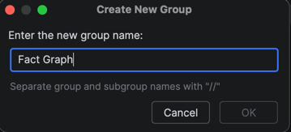
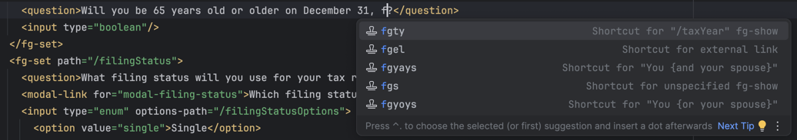
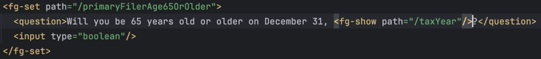

# Live Templates in IntelliJ

This directory holds shared IntelliJ [Live Templates](https://www.jetbrains.com/help/idea/using-live-templates.html) for the flow XML boilerplate that comes up most often: external links, `<fg-show>` elements, and the "you and/or your spouse" conditional spans. All of them are scoped to the XML context, so they fire inside `flow/*.xml` and not in Scala or YAML.

[`live-templates.xml`](./live-templates.xml) is the source of truth. Credit Assistant and Tax Withholding Estimator each carry an identical copy of this file. Benefits Enrollment does not have one yet.

## Import templates

> [!NOTE]
> Live Templates cannot currently be shared as an IntelliJ configuration in version control such that they are configured automatically when the project is opened. You have to import them by hand.

1. Open [live-templates.xml](./live-templates.xml) and copy its contents (`CMD + A`, `CMD + C`).
2. If you do not already have a template group set up, add one in `Settings > Editor > Live Templates`.
   1. Click `+` and select `Template Group`.
   2. Name the group however you prefer (for example `Fact Graph`) and select `OK`.

      

3. With the new template group selected, paste (`CMD + V`) the contents of `live-templates.xml` to add the preconfigured templates.
4. Verify the templates work by opening any flow XML file and starting to type a template's shortcut. A list of matching templates appears in Intellisense.

   

5. Finish typing the shortcut, or select the one you want and press `tab` or `enter` to apply it.

   

## Add a new template

1. Set up the template in `Settings > Editor > Live Templates`.
2. Verify that it works as intended.
3. Select the template you created and copy it (`CMD + C`). This copies its XML configuration.
4. Open [live-templates.xml](./live-templates.xml) and paste (`CMD + V`) it into the file.
5. Open a pull request so everyone else gets it. If the template is not app-specific, add it to Tax Withholding Estimator's copy too.
