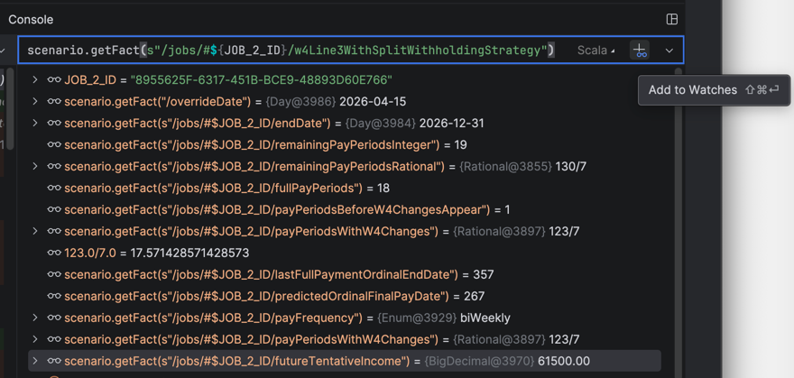

# Debugging UAT scenarios in IntelliJ

The tests in [UatScenariosSpec.scala](../../../../../src/test/scala/gov/irs/twe/factDictionary/scenarios/UatScenariosSpec.scala) build a Fact Graph from one column of the UAT spreadsheet and then assert calculated values against it. When an assertion fails, the message names only the fact that was checked. The value you need is often upstream of it in the graph.

This guide covers pausing a scenario test mid-run with IntelliJ's debugger and using [**Watches**](https://www.jetbrains.com/help/idea/examining-suspended-program.html#watches) to inspect any number of facts at once.

## Debug a single scenario

1. Find the `test("...")` block for the scenario you want to debug.

2. Set a breakpoint anywhere inside the test after the `val scenario = td.scenario` line, so that `scenario` is in scope when execution pauses.

3. Click the gutter icon to the left of the `test("...")` line and choose **Debug 'scenario name'**. IntelliJ auto-creates a ScalaTest run configuration scoped to that one test.

   

4. Execution pauses at your breakpoint and the **Debug** tool window opens.

## Inspect facts with Watches

Watches are expressions the debugger re-evaluates every time execution pauses. For scenarios, they usually take the form `scenario.getFact("/some/fact/path")`.

1. In the Debug tool window, open the **Threads & Variables** tab and find the **Watches** section (or the dedicated **Watches** tab, depending on your layout).

2. Click `+` to add a watch.

3. Type a `scenario.getFact(...)` expression. For example:

   ```scala
   scenario.getFact("/agi")
   scenario.getFact("/taxableIncome")
   scenario.getFact("/standardOrItemizedDeduction")
   ```

   For **collection-scoped facts** (jobs, pensions, Social Security sources, and so on), use Scala string interpolation with the ID constants `UatScenariosSpec.scala` already imports:

   ```scala
   scenario.getFact(s"/jobs/#$JOB_1_ID/w4Line4cWithSplitWithholdingStrategy")
   scenario.getFact(s"/jobs/#$JOB_2_ID/w4Line4bWithSplitWithholdingStrategy")
   ```

   `JOB_1_ID` through `JOB_4_ID` and the other collection IDs are defined in [`Scenario.scala`](../../../../../src/main/scala/gov/irs/twe/scenarios/Scenario.scala). The spec imports the ones it uses, so the interpolation in a watch resolves the same way it does in the test body.

4. Repeat for every fact you want to monitor.

   

## Tips

- **Step over assertions to watch values change.** Some derived facts depend on `graph.set(...)` calls inside the test body, for example `scenario.graph.set("/wantsStandardDeduction", false)`. Step over those lines to see watch values update.
- **Compare against the spreadsheet.** `scenario.getExpectedSheetValueByFactPath("/agi")` returns the `(sheetRowName, rawSpreadsheetValue)` tuple for a derived fact. Add it as a watch to see what the spreadsheet expects next to what the Fact Graph computed.
- **Reuse watches.** Watches persist across debug sessions, so debugging a different scenario keeps every watch you already defined.
